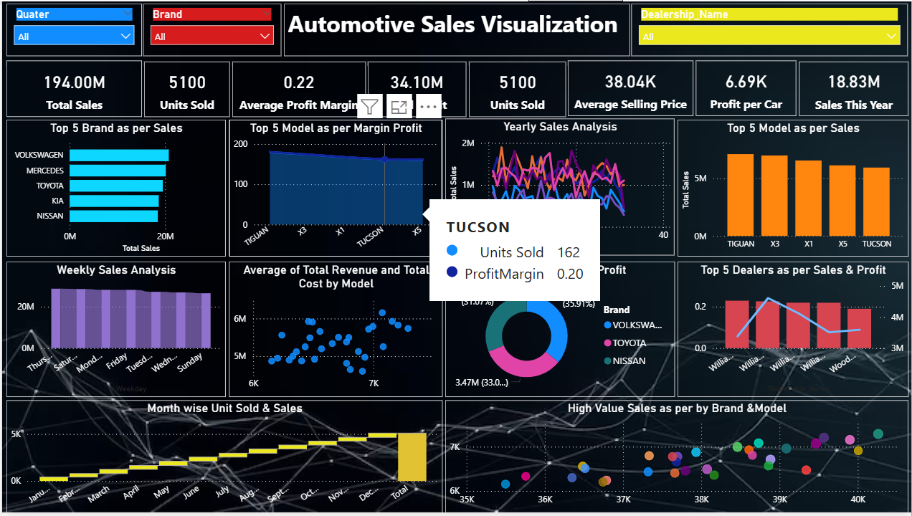

# 🚗 CARs-Sales-Analysis-Power-BI-Dashboard-

This project analyzes car sales data across various dealerships to uncover insights related to revenue, dealership performance, and customer trends. The interactive dashboard was built using Power BI with data from CSV sources.

---

## 📁 Project Files

- `Automotive_sales.csv` – Sales transaction data  
- `Dealership_Info.csv` – Dealership locations and details  
- `CARs.pbix` – Power BI report file  
- `README.md` – Project documentation  

---

## 🎯 Objectives

- Analyze overall automotive sales performance  
- Compare dealerships based on revenue, profit, and region  
- Identify top-performing car models and trends over time  
- Provide interactive filtering and slicing for business insights  

---

## 📊 KPIs & Metrics

- Total Sales Revenue  
- Units Sold  
- Average Selling Price  
- Profit per Vehicle  
- Top Selling Car Brands  
- Sales by Region, Year, and Dealership  

---

## 📈 Visuals Included

- 📊 Sales by Dealership (Bar Chart)  
- 📆 Sales Over Time (Line Chart)  
- 🚘 Top Car Models Sold (Column Chart)  
- 🌍 Regional Sales Distribution (Map)  
- 💰 Profit by Vehicle Type (Pie Chart)  
- 🧭 Filters for Year, Brand, Location, Dealership  

---

## 🔧 Tools Used

- Power BI Desktop  
- Microsoft Excel / CSV  
- DAX & Power Query  

---

## 📸 Dashboard Preview

```markdown

